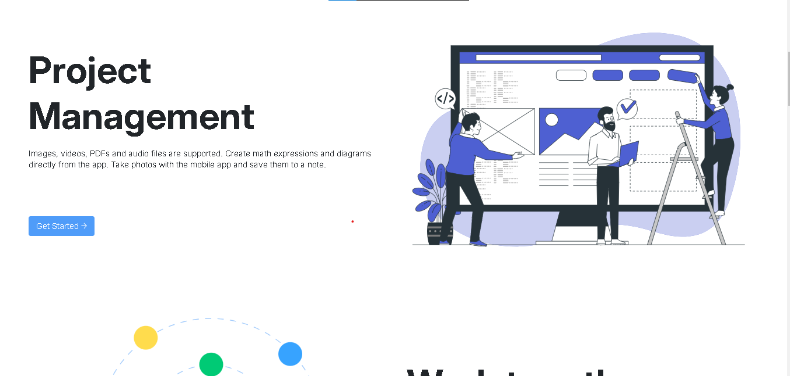

# Whitepace - Project Management Software Landing Page

Welcome to the **Whitepace** repository! This is a responsive and modern landing page for a **project management software**, designed to help teams **collaborate, plan, analyze, and manage tasks efficiently**.

## 📸 Home
 *(Replace with actual screenshot URL)*
## 🌟 Features
- **Fully Responsive Design** – Optimized for all screen sizes.
- **Modern Web Technologies** – Built with HTML5, CSS3, and JavaScript.
- **Flexbox Layout** – Ensures a clean and flexible structure.
- **CSS-Only Burger Menu** – Smooth navigation experience on mobile devices.
- **Optimized Performance** – Fast loading and lightweight.
- **Clean & Minimalist UI** – User-friendly interface with an elegant design.

## 🚀 Technologies Used
- **HTML5** – Structured and semantic markup.
- **CSS3** – Stylish and responsive design.
- **JavaScript** – Enhances interactivity and functionality.
- **Flexbox** – Ensures a flexible and responsive layout.

## 📸 Screenshots
 *(Replace with actual screenshot URL)*
## 📸 Screenshots
 *(Replace with actual screenshot URL)*
## 📸 Screenshots
 *(Replace with actual screenshot URL)*

## 🔧 Installation & Usage
1. Clone the repository:
   ```bash
   git clone https://github.com/yourusername/whitepace.git
   ```
2. Navigate to the project folder:
   ```bash
   cd whitepace
   ```
3. Open `index.html` in your browser or use a live server extension.

## 🌍 Live Demo
Check out the live version here: [Whitepace Live Demo](https://lechehebdjaafar.github.io/whitepace/) *(Replace with actual live demo URL)*

## 📄 License
This project is licensed under the **MIT License** – feel free to modify and distribute it.

## 📩 Contact
For any inquiries, feel free to reach out:
- **Linkdin:** [Djaafar Lecheheb](https://www.linkedin.com/in/lecheheb-djaafar-226594348/)

---

Happy Coding! 🚀

